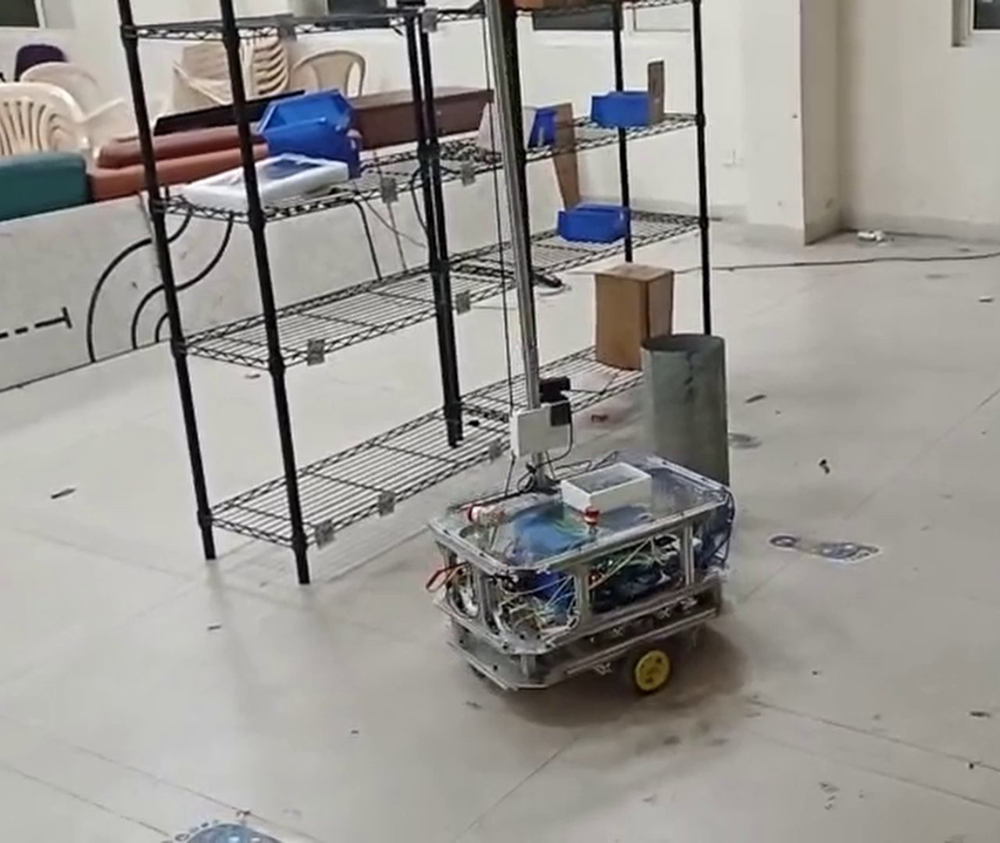
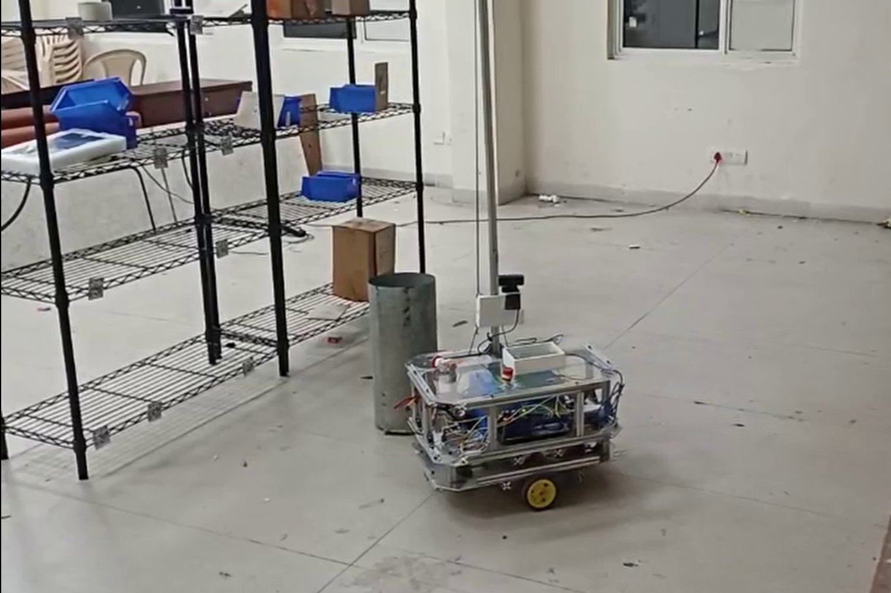
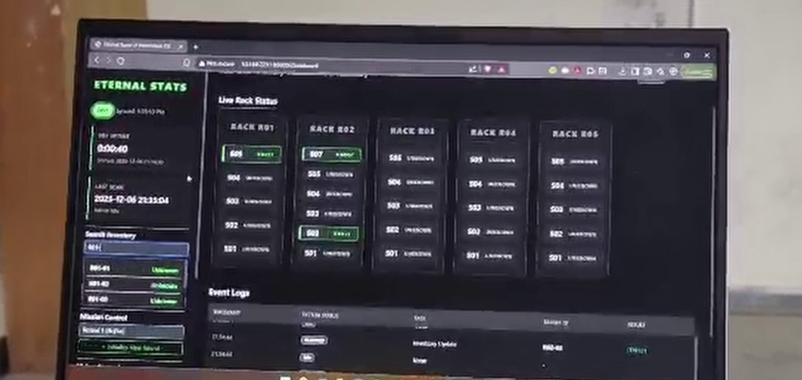
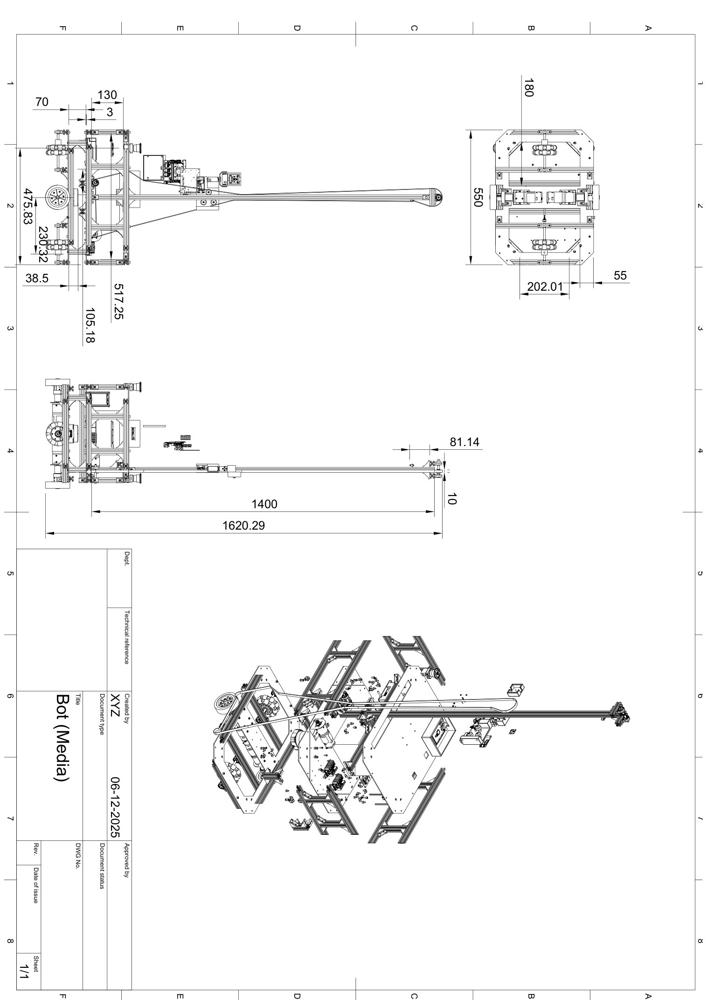
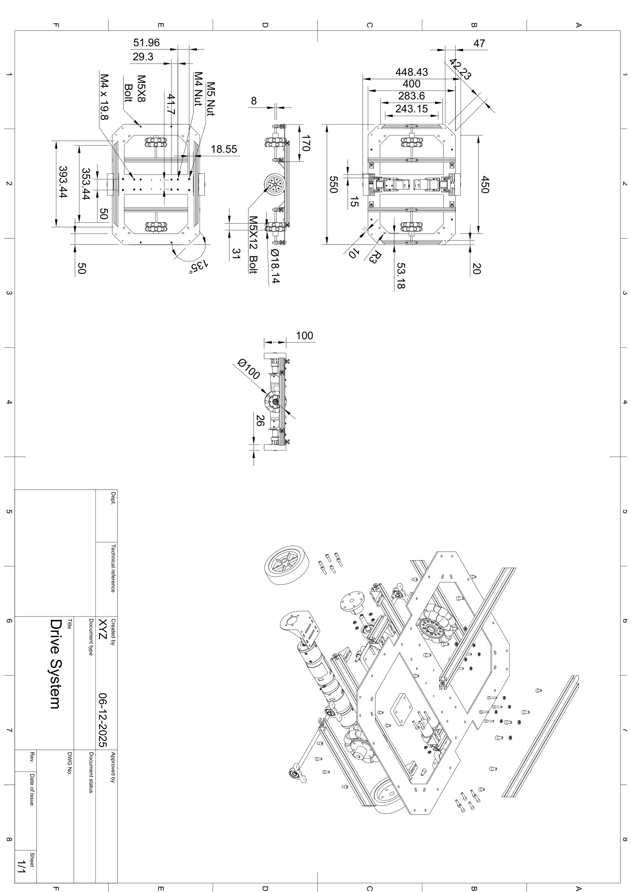
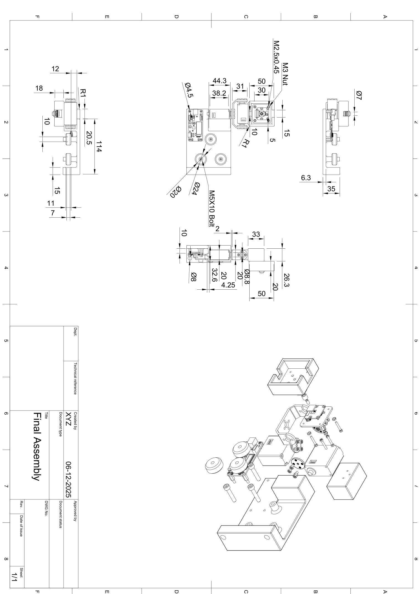
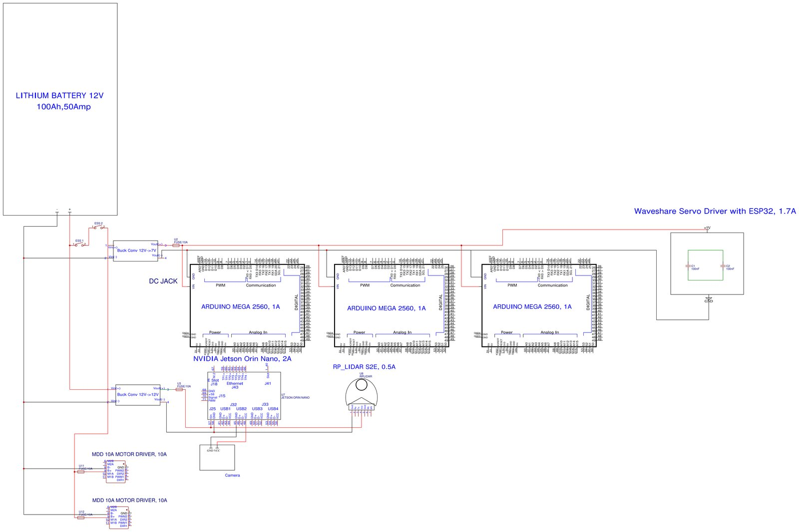

<div align="center">

# Autonomous Rover for Warehouse Rack Inventory

A differential-drive rover that drives warehouse aisles, reaches racks with a tall scanning mast, and logs shelf inventory to a live dashboard.

</div>

<p align="center">
  
</p>

<p align="center">
  
</p>

Aluminum chassis, clear electronics deck, yellow drive wheels, and a vertical mast that carries the camera up the rack face. LiDAR sits on the deck for mapping and obstacle avoidance.

| | |
|:--|:--|
| **Compute** | NVIDIA Jetson Orin Nano Super |
| **Navigation** | RPLiDAR S2E · BNO055 IMU · ROS 2 Nav2 + EKF |
| **Drive** | IG42 / IG45 geared motors · Cytron MDD10A · Arduino Mega ×3 |
| **Mast** | Waveshare IMX258 camera on SC15 bus servos |
| **Power** | 12 V 100 Ah LiFePO4 |
| **Operator view** | Flask dashboard — live rack grid, telemetry, scan events |

---

## On the floor

| Clip | |
|------|--|
| [Driving and obstacle avoidance](hardware/Videos/obstacle_avoidance.mov) | Full rover moving between racks |
| [Vertical scanning](hardware/Videos/Vertical_scanning.mov) | Mast and camera at shelf height |
| [SLAM](hardware/Videos/Slam.mov) | Mapping run |
| [Dashboard](hardware/Videos/HMI.mov) | Live rack status on the operator laptop |

<p align="center">
  
</p>

---

## Mechanical and electrical

<p align="center">
  
  
  
</p>

<p align="center">
  
</p>

CAD: [`hardware/CAD_Models/CAD and Drawings/Bot.step`](hardware/CAD_Models/CAD%20and%20Drawings/Bot.step) · BOM: [`hardware/BOM.csv`](hardware/BOM.csv) · schematics: [`hardware/Electrical_Schematics/`](hardware/Electrical_Schematics) · write-up: [`docs/technical-documentation.pdf`](docs/technical-documentation.pdf)

---

## Software

```
code/                 robot software
  src/src/
    bot_description   URDF, Gazebo, RViz
    bot_bringup       Nav2, EKF, commander
    bot_broadcaster   odom, IMU, joints, cmd_vel to Arduino
    bot_scanning      mast, camera, shelf reads
    rplidar_ros       Slamtec driver
  Utils/              Arduino sketches
  hmi/                operator dashboard
hardware/             CAD, BOM, schematics, videos
vision/               lab experiments and extra notes
```

On the Jetson, after `colcon build` and `source install/setup.bash`:

```bash
ros2 launch bot_bringup my_bot.launch.py
```

Dashboard:

```pwsh
cd code/hmi
python -m venv .venv
.\.venv\Scripts\Activate.ps1
pip install -r requirements.txt
python app.py
```

Open `http://localhost:5000`. The rover posts telemetry and shelf updates to `POST /api/update`.

Videos are stored with Git LFS.

```bash
git lfs install
git clone https://github.com/Manashvi1205/inter-iit-25.git
```
