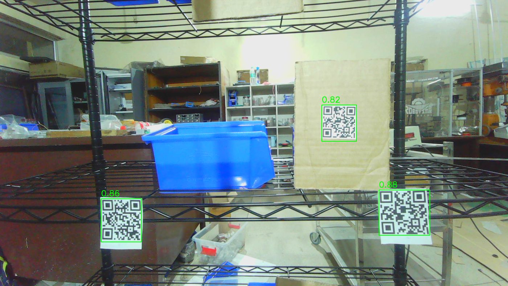
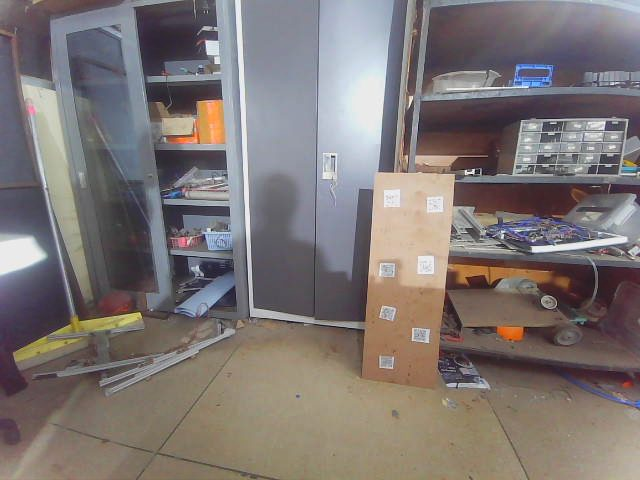
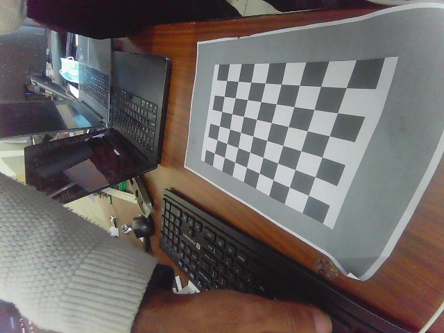
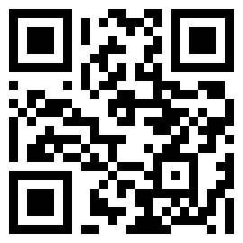
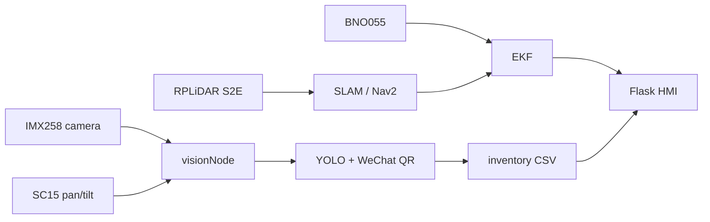

<div align="center">

# Eternal Rover

**Team 27** · Inter IIT Tech Meet · Autonomous warehouse inventory rover

ROS 2 navigation · QR shelf scanning · Jetson Orin Nano · live mission-control HMI

</div>

<p align="center">
  
</p>
<p align="center"><em>Onboard camera: YOLO / WeChat QR detections on a real rack (confidence 0.82–0.88).</em></p>

---

A differential-drive rover that maps a warehouse with **RPLiDAR SLAM**, drives to racks, pans a camera on bus servos, reads shelf QR codes, and posts inventory to a dark **mission-control dashboard**.

| | |
|:--|:--|
| **Compute** | NVIDIA Jetson Orin Nano Super |
| **Sense** | RPLiDAR S2E (30 m) · Waveshare IMX258 13 MP OIS camera · BNO055 IMU |
| **Actuate** | IG42 / IG45 geared motors · Cytron MDD10A · SC15 bus servos · Arduino Mega ×3 |
| **Power** | 12 V 100 Ah LiFePO4 (~₹1.23 L BOM) |
| **Stack** | ROS 2 (Nav2, EKF) · OpenCV / YOLO QR · Flask HMI · Arduino firmware |

---

## Demos

Recorded on the robot. Videos sit in [`hardware/Videos/`](hardware/Videos) (Git LFS).

| Clip | What you see |
|------|----------------|
| [Vertical scanning](hardware/Videos/Vertical_scanning.mov) | Camera mast / shelf sweep |
| [HMI](hardware/Videos/HMI.mov) | Mission-control dashboard live |
| [Obstacle avoidance](hardware/Videos/obstacle_avoidance.mov) | LiDAR-based avoidance |
| [SLAM](hardware/Videos/Slam.mov) | Mapping run |

---

## Vision in the field

The scanner does not guess shelves from a static map. It **looks**: pan/tilt capture → detect QR → decode item IDs → write CSV → `POST /api/update` to the HMI.

<p align="center">
  
  
</p>
<p align="center">
  <sub>Left: camera view of a QR calibration board. Right: intrinsic calibration (chessboard).</sub>
</p>

<p align="center">
  
</p>
<p align="center"><sub>Example encoded tag (`R01` / slot / item) like the ones on the racks.</sub></p>



---

## Mechanical design

Bot *(Vledia)* — exploded / orthographic assembly plus camera and drivetrain drawings.

<p align="center">
  
  
  
</p>

Full CAD: [`hardware/CAD_Models/CAD and Drawings/Bot.step`](hardware/CAD_Models/CAD%20and%20Drawings/Bot.step)

### Power architecture

12 V pack → buck rails → three Arduino Megas, Jetson, LiDAR, dual MDD10A motor drivers, ESP32 servo board.

<p align="center">
  
</p>

Schematics live in [`hardware/Electrical_Schematics/`](hardware/Electrical_Schematics). BOM: [`hardware/BOM.csv`](hardware/BOM.csv).

---

## Software

```
code/                    live robot software
  src/src/
    bot_description      URDF, Gazebo worlds, RViz
    bot_bringup          Nav2, EKF, commander
    bot_broadcaster      odom / IMU / joints / cmd_vel → Arduino
    bot_scanning         Scanner, Processor, servos, QR
    rplidar_ros          Slamtec driver (vendored)
  Utils/                 Arduino sketches
  hmi/                   Eternal Rover Mission Control
hardware/                CAD, BOM, schematics, demo videos
vision/                  experiments, extra HMI clones, annotated logs
docs/                    write-up + README photos
```

**Use `code/`.** Folders under `vision/` are lab history (duplicate dashboards, prototypes).

### Bringup (Jetson)

```bash
colcon build --symlink-install
source install/setup.bash
ros2 launch bot_bringup my_bot.launch.py
```

Gazebo check: `ros2 launch bot_description gazebo_test.launch.py`

### Mission-control HMI

Dark dashboard: live telemetry, racks A–F × 5 levels, empty-shelf alerts, vision capture buttons.

```pwsh
cd code/hmi
python -m venv .venv
.\.venv\Scripts\Activate.ps1
pip install -r requirements.txt
python app.py
```

Open `http://localhost:5000`. Demo login is `admin` / `password` — change it before putting this on a network.

Jetson → `POST /api/update` (battery, pose, `shelf_id` like `C-03`, `shelf_status` Empty/Full). Details: [`code/hmi/README.md`](code/hmi/README.md).

Vision extras: [`vision/d.md`](vision/d.md) · [`docs/technical-documentation.pdf`](docs/technical-documentation.pdf)

---

## Clone

Videos are **Git LFS**. Without LFS you only get pointer files.

```bash
git lfs install
git clone https://github.com/Manashvi1205/inter-iit-25-team-27.git
```
