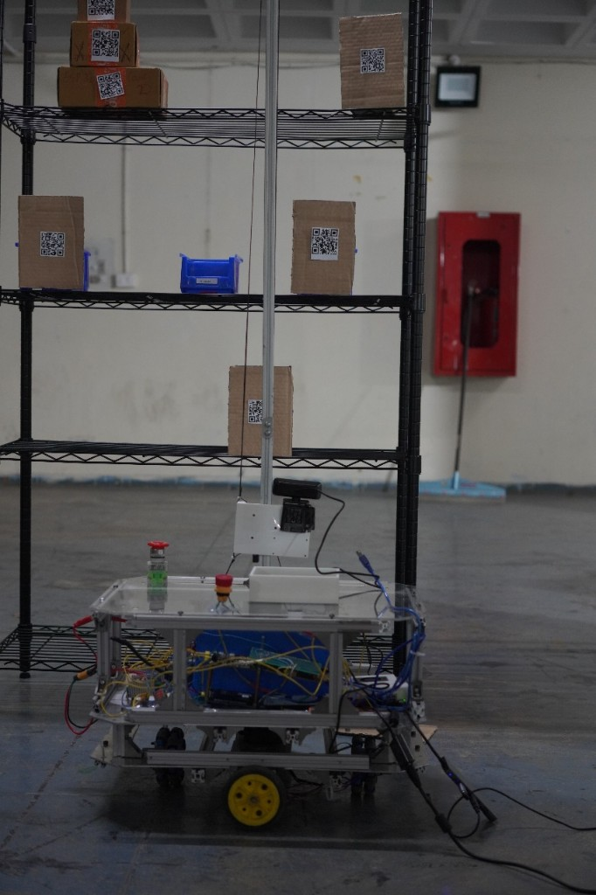
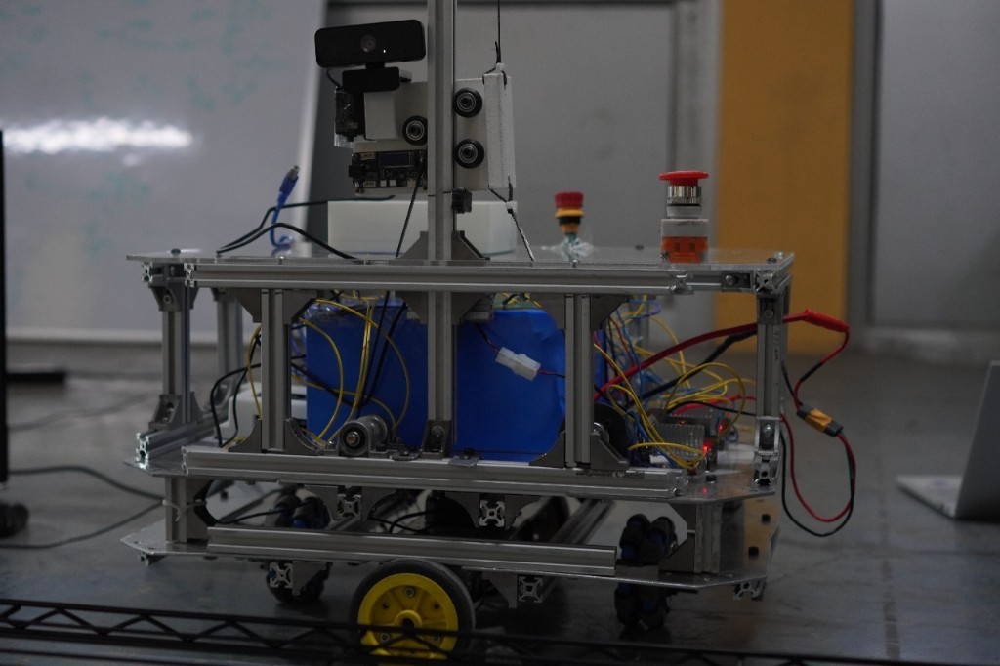
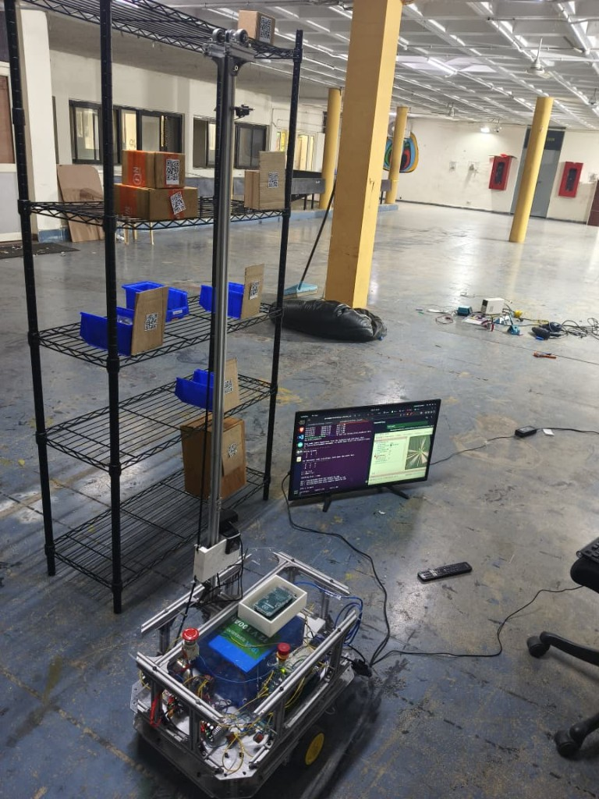
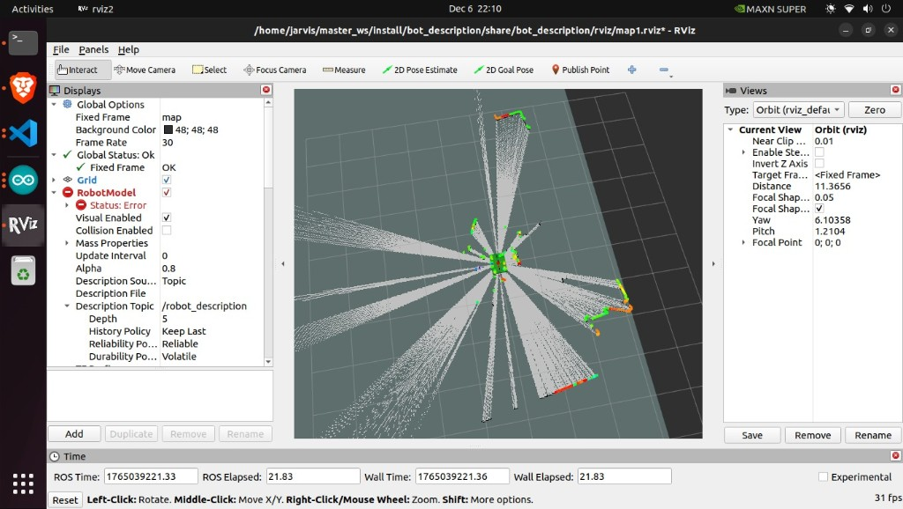

# Autonomous Rover for Warehouse Rack Inventory

Warehouse records drift. Items get picked, put back on the wrong shelf, or never scanned, and the database stops matching the rack. This rover closes that gap on the floor. It drives the aisle, stops in front of a bay, runs a camera up the rack face, reads the label at each level, and writes the result to a live inventory view.

The machine is a full mobile robot, not a camera on a stick. A ~25 kg differential-drive base carries compute, LiDAR, batteries, and motor drivers. A belt-driven mast lifts the camera from the floor to about 1.8 m. Three Arduino Megas and an ESP32 handle motors, encoders, the IMU, and the pan-tilt, while a Jetson Orin Nano runs ROS 2 navigation and the scan.

The design targets are concrete: align with a rack to better than ±10 cm horizontally and ±2 cm vertically, scan a 1.8 m rack segment in under 3 minutes at 1920×1080, decode 5 cm labels with better than 90% success, and stop in under 500 ms on an emergency press.

<p align="center">
  
</p>

The rover in front of a rack. The camera carriage sits on the mast; the clear deck holds the battery, controllers, and emergency stop.

---

## How a run works

1. The operator gives a goal in the mapped warehouse. Nav2 plans a path on the occupancy grid and the base drives to the bay.
2. The base settles in front of the rack. Wheel encoders, the BNO055, and the RPLiDAR keep the pose stable enough for the camera to face the shelf.
3. The IG45 lift motor runs the timing belt until the carriage is at the next shelf height. Encoder ticks are mapped at 163 ticks per centimetre of travel.
4. If a label sits at the edge of the frame, two SC15 servos pan and tilt the camera. The IMX258 then captures the shelf.
5. The vision node detects the code, projects it onto the rack plane, and logs rack, shelf, item id, and pose. Duplicates from the same stop are dropped.
6. The Flask dashboard reads that table and shows which slots are filled, which are empty, and what the rover just did.

Two streams run at once. Motion data (`/scan`, `/imu`, `/odom`) stays on the Jetson and never waits for the website. Scan results are written beside that pipeline and served to the operator over HTTP, so a slow browser refresh cannot stall navigation.

---

## Base

The footprint stays inside 600 mm × 450 mm so the robot can turn inside an aisle. The centre of rotation sits near the geometric centre: two driven wheels on the sides, one caster at the front and one at the rear. All four share the load, and the corners stay inside the clearance next to the racks.

The load-bearing plate is 3 mm aluminium. The other decks are 3 mm acrylic, held in 2020 aluminium extrusion with M5 fasteners (M4 and M3 on mounts and hubs). Mild-steel shafts carry the rotating parts. Edges are chamfered and covered by the extrusion so there are no sharp corners at shin height.

<p align="center">
  
</p>

Drive is two IG42 planetary gearmotors with built-in encoders, through one Cytron MDD10A. The Mega closes the speed loop from the encoder counts and publishes wheel odometry to the Jetson over serial. HD rubber wheels are sized for smooth warehouse floors: enough grip to start and stop a 25 kg robot without the slip that would wreck the odometry.

The second MDD10A drives the mast motor on the same style of PWM and direction interface, so base and lift look the same to the controller. The Jetson sends velocity and a Z target; the Mega turns those into PWM.

---

## Mast

Vertical travel is a continuous timing belt on a rigid extrusion column. The belt stays in one plane over the motor pulley, a top idler, and an in-line idler, so the carriage is pulled both up and down instead of relying on friction. A long bolt acts as a passive tensioner. Guided rollers keep the carriage from twisting when the camera and servo board are on it.

Clockwise rotation of the IG45 lowers the carriage; counter-clockwise raises it. Because the column is stiff, the lift does not run a second position loop on the Jetson. A constant PWM runs until the encoder count matches the shelf height. Limit switches at the top and bottom are wired normally closed and cut the motor if the carriage travels past the stroke.

On the carriage, two SC15 bus servos add pan and tilt. A Waveshare ESP32 board on the carriage drives them and reports angle, so the vision node knows where the camera was pointing when the frame was taken. At the end of a session the camera is sent back to a recorded home pose.

<p align="center">
  
</p>

---

## Navigation

Localisation is three measurements fused on purpose.

- Wheel encoders give short-term motion, including the lift height.
- The BNO055, on its own Mega over I2C, publishes fused orientation. The chip does the sensor fusion onboard and outputs a quaternion, so the robot does not run a separate attitude filter.
- The RPLiDAR S2E sweeps 360° out to 30 m at over 10 kHz. It talks to the Jetson over Ethernet, not USB, for bandwidth and noise. The laser is eye-safe for people working next to the aisle.

An EKF (`robot_localization`) fuses encoders and IMU into `/odom` and the `odom` → `base_link` transform. SLAM Toolbox consumes `/scan` plus that pose, builds a 2D occupancy grid, and publishes `map` → `odom`, which is what removes long-term drift. The static `base_link` → `laser` transform is the LiDAR mount.

Nav2 plans on that map. The global planner is NavFn with A*. The local controller is DWB: it samples twists around the nominal command and scores them against the costmaps, which matters because the two drive motors are not perfectly matched and the base would otherwise walk off the path. Costmaps are layered — static map, live obstacle inserts from the LiDAR, and an inflation layer around the footprint. If the local planner cannot find a safe command, the behaviour tree clears the costmap, spins, or replans.

<p align="center">
  
</p>

---

## Scanning

The camera is a Waveshare IMX258, 13 MP, with optical image stabilisation, on USB so the cable run up the mast stays simple. Capture waits until the lift and the servos have settled, then grabs a frame.

Detection is a two-stage read. A detector proposes QR regions. Those regions are warped onto the rack plane with a homography, cleaned up for indoor lighting, and decoded. Each hit is stored with rack id, shelf, payload, confidence, and the robot pose at that moment. The same code seen twice in one stop is not logged twice. Annotated frames can be saved when a threshold needs tuning.

Results land in `inventory.csv`. The dashboard does not talk to ROS directly. A Flask app reads the CSVs (`rover_data.csv` for telemetry, `racks.csv` for the layout, `inventory.csv` for scans) and the page polls JSON. Operators get rack cards, an event log with timestamps, and buttons for a normal capture, a top or bottom look, or a full sweep, plus LED and servo controls. Login is session-based; the demo password in the HMI README should be changed before the page is reachable off the robot.

---

## Power and safety

A 12.8 V LiFePO4 pack feeds a small distribution board. Wiring on the battery input is rated to 50 A for acceleration and lift peaks.

| Rail | What it feeds |
|------|----------------|
| Battery bus, 12.8 V | Both Cytron MDD10A drivers, through a fuse: IG42 base motors and the IG45 lift |
| 7 V buck, 12 A | Three Arduino Megas, the ESP32 servo board, IMU, status LEDs, buzzer |
| 12 V buck, 12 A | Jetson Orin Nano and the LiDAR, on a fused branch that normally stays under 2 A |

Logic ground and power ground meet at one point on the board so encoder and serial lines stay quiet.

<p align="center">
  
</p>

Emergency-stop buttons sit on both sides and open the drive. Status LEDs and a buzzer report state without requiring the dashboard. Speed and acceleration are capped in software. Encoder feedback flags a stalled wheel. The Jetson can also command an immediate stop from the obstacle layer; the Mega applies it through the drivers.

---

## Mechanical drawings

Assembly of the full machine. The long member on the right of the side view is the mast. Overall length on the drawing is about 1.62 m with the mast laid in the view; the base itself is the compact chassis described above.

<p align="center">
  
</p>

Drive side: wheel spacing, motor mounts, and the caster line that puts the spin centre near the middle of the base.

<p align="center">
  
</p>

Camera carriage: the head that rides the belt, with the pan-tilt in front of the shelf.

<p align="center">
  
</p>

STEP model and the source PDFs: [`hardware/CAD_Models/CAD and Drawings/`](hardware/CAD_Models/CAD%20and%20Drawings). Bill of materials: [`hardware/BOM.csv`](hardware/BOM.csv). Schematics: [`hardware/Electrical_Schematics/`](hardware/Electrical_Schematics). Full write-up: [`docs/technical-documentation.pdf`](docs/technical-documentation.pdf).

---

## Software in the repo

```
code/
  src/src/
    bot_description    URDF, Gazebo worlds, RViz configs
    bot_bringup        Nav2 params, EKF, bringup launch, commander
    bot_broadcaster    odometry, IMU, joint states, cmd_vel to the Mega
    bot_scanning       lift, servos, capture, QR pipeline
    rplidar_ros        Slamtec driver
  Utils/               Arduino sketches: drive, odometry, IMU, servos, LEDs, buzzer
  hmi/                 Flask dashboard
hardware/              CAD, BOM, schematics, demo videos
vision/                earlier scanner experiments and notes
```

`code/` is the robot. `vision/` is lab history.

On the Jetson, after a colcon build and `source install/setup.bash`:

```bash
ros2 launch bot_bringup my_bot.launch.py
```

Dashboard, from `code/hmi`:

```pwsh
python -m venv .venv
.\.venv\Scripts\Activate.ps1
pip install -r requirements.txt
python app.py
```

Open `http://localhost:5000`. The robot posts telemetry and shelf updates to `POST /api/update`.

Demo clips, stored with Git LFS: [driving and obstacle avoidance](hardware/Videos/obstacle_avoidance.mov), [mast scan](hardware/Videos/Vertical_scanning.mov), [SLAM](hardware/Videos/Slam.mov), [dashboard](hardware/Videos/HMI.mov).

```bash
git lfs install
git clone https://github.com/Manashvi1205/warehouse-rover.git
```
